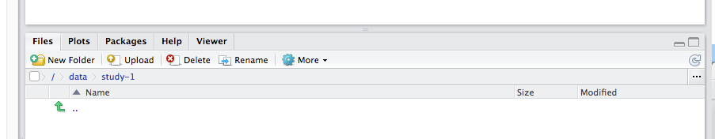
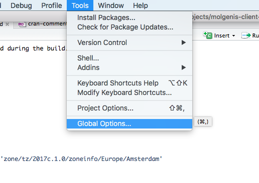
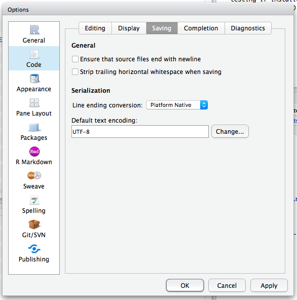

## MOLGENIS R-api

The MOLGENIS R-api can communicate with an MOLGENIS instance and perform actions on that instance.

## Usage

You can import this project by executing:

```r
library(molgenisRApi)
```

When you want to install the package and it's depodencies automatically you can execute:

```r
install.packages("molgenisRApi", dependencies = TRUE)
```

This will import the right dependencies when you have installed them in your own environment.

With ```molgenis.``` you can view which functions are available to use with a MOLGENIS instance.

## Development

With the devtools and the roxygen2 library you can develop on this package. By importing the two libraries you can document the code and generate other dev-stuff.

```r
library(devtools)
library(roxygen2)
```

You can install the R-pacakge via Github when you have loaded the devtools-package (see above). Just run:

```r
install_github("#username#/#repo#")
```

Example:

```r
install_github("sidohaakma/molgenis-client-r-spss")
```

## Releasing

To release you have to make sure all warnings are removed during the build.

### Set right locale 

Enter in your R-terminal

```r
Sys.setenv(TZ="Europe/Amsterdam")
```

This will prevent this warning:

```r
Warning in as.POSIXlt.POSIXct(x, tz) : unknown timezone 'zone/tz/2017c.1.0/zoneinfo/Europe/Amsterdam'
```

### Set the right encoding

Go to "Tools --> Global options"






Go to "Code --> Saving"



Set UTF-8 in encoding field. This will prevent

```
Warning messages: 
  Setting LC_CTYPE failed, using "C" 
  Setting LC_COLLATE failed, using "C" 
  Setting LC_TIME failed, using "C" 
  Setting LC_MESSAGES failed, using "C" 
  Setting LC_MONETARY failed, using "C" 
```

### Expose use methods in NAMESPACE

To get rid of NOTE's in the "check-phase" of the build you have to add exposure tags in the documentation. You can do this by adding:

```r
@importFrom #package# #method1# #method2# #method3# #method4#
@importFrom #package# #method5# #method6# etc..
```

You can add upto 4 methods per line. Then run ```devtools::document()``` to write the new NAMESPACE-file.